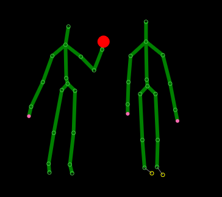
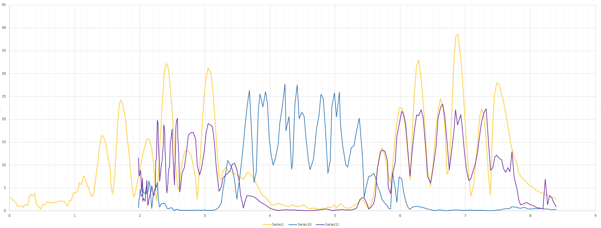

# Android detection in a Kinect scene

Someone is holding a phone in his hand, the program detects which one (big red dot)

This is done comparing the accelerations of the hands in the image, and the acceleration the phone. Datas need to be synchronized using NTP.

Yellow : Phone's acceleration \
Other colors : Hands accelerations
